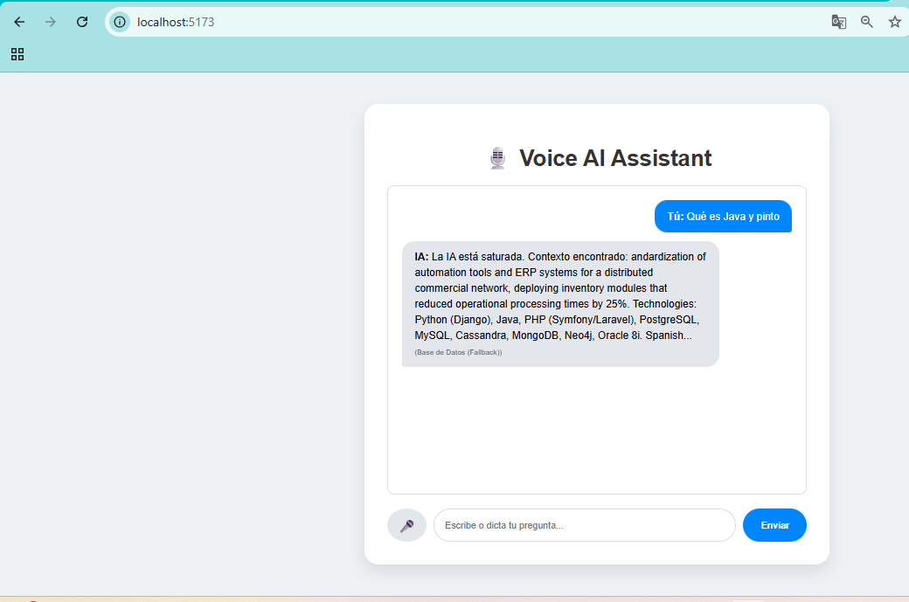

# 🎙️ Voice AI RAG Core - Architecture Demo

> **Status:** Production Ready (MVP)  
> **Role:** AI Engineer / Full Stack Developer

Este repositorio aloja el núcleo ("Core") de un asistente de IA conversacional con capacidades de **Voz (Voice AI)** y Memoria a Largo Plazo (**RAG**), diseñado para entornos corporativos de alto cumplimiento (ISO 27001).



## ⚡ Voice AI Pipeline (Arquitectura)

El sistema implementa un flujo de baja latencia para interacción por voz, cumpliendo con el ciclo moderno de IA:

1.  **ASR / STT (Speech-to-Text):** Captura de audio en tiempo real y transcripción mediante *Web Speech API* (preparado para migración a OpenAI Whisper).
2.  **Reasoning Engine (LLM):** Procesamiento semántico con modelos Open Source (`Zephyr-7b-beta`) vía Hugging Face Inference.
3.  **RAG Context retrieval:** Recuperación de información técnica desde **PostgreSQL (pgvector)** para evitar alucinaciones.
4.  **TTS (Text-to-Speech):** Síntesis de voz automática para respuesta audible al usuario.

## 🛠️ Tech Stack

* **Frontend:** React.js + Vite + Web Speech API (Native STT/TTS).
* **Backend:** Node.js (Express) con manejo de errores y Fallback robusto.
* **Database:** PostgreSQL 16 + `pgvector` (Vector Store).
* **Infrastructure:** Docker & Docker Compose (Microservicios).
* **Observability:** SQL Transactional Logging (Auditoría de preguntas/respuestas).

## 🚀 Instalación y Despliegue

### 1. Requisitos Previos
* Docker & Docker Compose
* Node.js v18+ (para desarrollo local)

### 2. Configuración
Clona el repositorio y configura las variables de entorno:

```bash
git clone [https://github.com/Mhakos/voice-ai-rag-core.git](https://github.com/Mhakos/voice-ai-rag-core.git)
cd voice-ai-rag-core

Desarrollado por **Mhakos Pavone**.